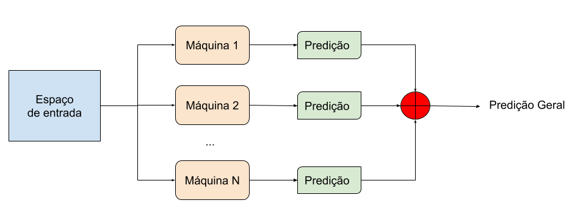

# comitemaquinas
<h1>Comitê de Máquinas de Aprendizado (Ensemble Learning) - Voto Majoritário</h1>

O vídeo-tutorial pode ser visualizado <a href="https://www.youtube.com/watch?v=41yF29X8QTA">neste link</a>

A técnica de Comitê de Máquinas é baseada no conceito de diversidade

Existem algumas abordagens para obter diversidade:

<ul>
<li>Subamostragem do espaço de entrada. Exemplo: seleção de conjuntos de dados com alguma intersecção.</li>
<li>Subamostragem dos atributos. Exemplo: utilizar atributos com mesma característica.</li>
<li>Configuração dos hiper-parâmetros dos modelos. Exemplo: número de iterações, tolerância, número de camadas ocultas, etc.</li>
<li>Utilização de distintos algoritmos. Exemplo: Redes Neurais, Árvores de Decisão, KNN, etc.</li>
</ul>

<h3>Referências</h3>
Ditterrich, T., 1997. Machine learning research: four current direction. Artificial intelligence magazine 4, 97–136.
Polikar, R., 2006. Ensemble based systems in decision making, volume 6, 21–45. doi:10.1109/MCAS.2006.1688199
Raschka, S., 2018. Mlxtend: Providing machine learning and data science utilities and extensions to python’s scientific computing stack 3. doi:10.21105/joss.00638.
Rokach, L., 2010. Pattern Classification using Ensemble Learning. volume 75 of Series in Machine Perception and Artificial Intelligence. New Jersey.
Sagi, O., Rokach, L., 2018. Ensemble learning: A survey. Wiley Interdisciplinary Reviews: Data Mining and Knowledge Discovery 8, e1249.
<a href="https://www.sciencedirect.com/science/article/abs/pii/S0169260718312434">Oliveira, B.R.d., Abreu, C.C.E.d., Duarte, M.A.Q., Vieira Filho, J., 2019. Geometrical features for premature ventricular contraction recognition with analytic hierarchy process based machine learning algorithms selection,59–69 doi:10.1016/j.cmpb.2018.12.028.</a>

